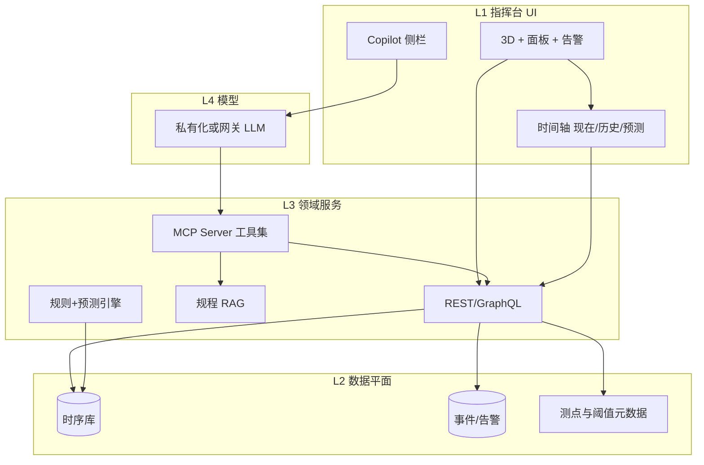

# AI 能力 brainstorm — 储罐 / 浮盘智能诊断平台

> 与产品负责人共创用。基于当前演示平台（可视化 + 结构化传感数据 + 阈值规则），讨论 **AI / MCP / 预测 / 时序回放** 的可行路径、风险与分期建议。  
> 非承诺路线图；用于对齐愿景与砍 scope。

---

## 1. 你的四层架构 — 评价与微调

你描述的链条：

```
可视化平台（人看、操作）
    → 数据采集 / 数据底座
        → 垂直 MCP（行业“智能手表”数据出口）
            → 对话 / 报告 / 告警解释
                →（并行）算法预测 + 时序回放
```

**结论：方向正确。** 这和工业软件常见演进一致：**先让人信数据，再让机器用同一套数据说话**。

建议微调命名，避免团队把 “MCP” 和 “知识库” 混为一谈：

| 层 | 建议叫法 | 职责 |
|----|----------|------|
| L1 | **运行可视化 / 指挥台** | 告警、3D、测点、联动 — 你们已在建 |
| L2 | **时序与事件数据平面** | 统一罐、测点、阈值、告警、工况的 API + 存储 |
| L3 | **领域工具层（含 MCP）** | 只读查询、规程检索、报告模板 — 给 AI *调用*，不替代 L2 |
| L4 | **体验层** | 聊天、告警 Copilot、报告生成、预测卡片、回放轴 |

**MCP 应落在 L3，不是 L2。** L2 是数据库/流；L3 是 *协议化的工具接口*，让任意 LLM 客户端（Cursor、内部 Copilot、钉钉机器人）用同一套方式问罐区问题。

---

## 2. MCP 是什么 — 用你的产品语言解释

**Model Context Protocol（MCP）** 不是模型本身，也不是训练数据集。

可以把它想成：**给 AI 装的“储罐专用 API 说明书 + 插头”**。

- **Host**：带聊天的应用（你们的 Web 指挥台、Cursor、企业微信机器人）。
- **MCP Server（你们建）**：暴露一组 **tools**（例如 `get_tank_snapshot`, `get_sensor_series`, `explain_alert`）和可选 **resources**（规程 PDF、TG04 点位图、阈值表）。
- **LLM**：决定何时调用哪个 tool；tool 返回 **真实数据或规程摘录**，再组织成自然语言。

因此：

- ✅ “比通用 LLM 更可靠” — **前提是** 答案必须来自 tool 返回的实时/权威数据，而不是模型编造。
- ❌ “建一个 MCP = 建好了知识库” — 知识库要单独维护（向量库 + 规程文档 + 元数据）；MCP 只是 **访问** 它们的统一方式。
- ❌ “MCP 替代 SCADA” — 它只读聚合；写操作（关阀、广播）应走人工确认 + 独立工单系统。

**和你们现状的关系：**  
`floatingRoofSensors.ts` 里已有 **测点 ID、TG04 布局、阈值说明、24h 序列** — 这是未来 MCP tool 的 **完美响应形状**，演示阶段可先 mock，接真 API 时 schema 不变。

---

## 3. 逐条验证你的想法

### 3.1 可视化平台 = 数据底座的前厅

**有效。** 操作员在 3D 上点的罐、选的 `T4_3`，就是 **grounding 上下文**（哪个罐、哪个点、哪条告警）。  
聊天/Copilot 应默认带上：`activeTankId`, `activeSensorId`, 最近 24h 曲线摘要 — 比空对话可靠一个数量级。

**漏洞：** 若只有 UI 状态、没有 **持久化事件流**，AI 无法回答 “上周三凌晨谁确认的告警”。  
→ L2 需要：**告警事件表 + 确认人 + 备注**（哪怕先是轻量 SQLite）。

---

### 3.2 垂直 MCP = 浮盘罐的“智能手表”出口

**类比准确。** 智能手表 = 连续生理信号 + 简单规则（心率过高）；储罐 = 温度环、液位差、倾角 + 阈值（你们已有 `tempStatus` / `levelStatus`）。

**MCP 第一批 tools（建议 6–8 个，少而精）：**

| Tool | 输入 | 输出 | 价值 |
|------|------|------|------|
| `list_tanks` | 罐区 id | 罐列表、状态摘要 | 导航 |
| `get_tank_roof_sensors` | tank_id | 测点表 + 当前值 + status | 对齐 3D |
| `get_sensor_timeseries` | sensor_id, range | 时序 + 统计 | 图表/问答 |
| `get_active_alerts` | tank_id? | 告警 + 关联测点 | 值班入口 |
| `explain_alert` | alert_id | 阈值、历史同类、建议检查项（模板+数据） | **高 ROI** |
| `search_ops_manual` | query | 规程片段（RAG） | 行业话术 |
| `compare_sensors` | id[] | 温差、环向分布 | 浮盘不均诊断 |
| `draft_shift_report` | shift, tanks[] | 结构化草稿 | 报告生成 |

**不要做进 MCP v1：** 直接写库、下发控制指令、未审计的“自动关罐”建议。

---

### 3.3 聊天框 + 行业可靠问答

**有效，但有条件。**

可靠公式：

```
用户问题
  →（可选）意图分类
  → 强制 tool 调用（罐/点/告警相关）
  → 仅基于 tool 结果生成回答
  → 引用：测点 ID、时间、阈值条文
```

**漏洞（必须产品化应对）：**

| 风险 | 缓解 |
|------|------|
| 幻觉 | 无 tool 数据则明确说“当前无数据”，禁止猜读数 |
| 责任 | UI 标注 **“辅助分析，不构成操作指令”**；关键建议需人工勾选 |
| 保密 | 罐区数据不出域；模型私有化或网关脱敏 |
| 过时规程 | RAG 文档版本号 + `effective_date` 显示在回答脚注 |

**比通用 ChatGPT 强的场景（优先做）：**

- “T4_3 为什么黄？” → 拉曲线 + 阈值 + 相邻点对比  
- “和上次类似告警比呢？” → 事件检索  
- “写一段交接班说明” → 模板 + 实时快照  

**弱的场景（延后）：** 开放式“储罐行业未来十年趋势” — 与值班无关。

---

### 3.4 预测：维护、预警、提前 flag

**方向对，顺序要对。**

建议 **三阶**，不要一步上深度学习：

1. **规则 + 趋势（现在就能做）**  
   - 24h 斜率、环向温差、连续 N 次预警  
   - 输出：`risk_score` + `reason_codes[]`（可解释）  
   - 与现有 `SensorStatus` 一致，操作员信得过  

2. **统计/经典时序（有 3–6 个月真数据后）**  
   - 季节性、残差异常、多测点相关性  
   - 浮盘 **倾斜/液位不均** 特别适合  

3. **深度学习（有标签 + 故障样本后）**  
   - 密封泄漏、卡盘等 — 需要现场标注，贵  

**漏洞：** 演示用 `Math.random()` 序列不能训练模型；预测功能上线前必须 **数据契约**（采样率、缺失、时钟同步）。

**产品形态：** 在 3D 测点上显示 “未来 6h 风险” 虚线徽章，比黑盒分数更安全。

---

### 3.5 时序回放：过去 / 现在 / 未来

**非常有产品感，和指挥台天然契合。**

| 模式 | 含义 | 实现要点 |
|------|------|----------|
| **现在** | 实时/准实时 | WebSocket 或轮询 |
| **过去** | 历史回放 | 时间轴 scrubber；3D 状态随时刻刷新 |
| **未来** | 预测预览 | 仅显示 **模型输出**，明显标注“模拟” |

**漏洞：**

- “未来”若与真实告警混淆 → 重大事故风险；视觉必须区分（虚线、水印、色板不同）。  
- 全罐区长周期回放 → 数据量大；按 **选中罐 + 时间窗** 加载，不要一次拉全罐区十年。

**和 AI 的结合：** 回放某一时刻时，Copilot 只能看到 **该时刻切片** 的工具接口 `get_state_at(t)`，避免用“现在的数据”解释“过去的问题”。

---

## 4. 架构草图（建议目标态）



---

## 5. 比你原想法更好或更稳的补充

1. **告警 Copilot 先于全功能聊天**  
   告警弹出 → 一键 “解释 + 建议检查步骤” → 转化率高于空白聊天框。

2. **结构化报告 > 自由对话**  
   `draft_shift_report` 输出固定章节（液位、浮盘、环境、未闭环告警），LLM 只填槽位，质量可控。

3. **数字孪生轻量版**  
   不必完整 CFD；用 **测点驱动的状态机**（正常 / 偏斜 / 积水风险）驱动 3D 色与文案即可。

4. **人在回路（HITL）**  
   AI 建议 → 值班员点 “采纳 / 误报 / 需现场复核” → 反馈进 L2，未来才能训模型。

5. **MCP  también 对内运维**  
   同一 MCP Server 给 Cursor 做二次开发、给报表脚本用 — 一套工具，多个 host。

6. **竞品差异一句话**  
   “通用大屏 + 通用 GPT” vs “**TG04 测点语义 + 阈值可追溯 + 工具强制接地** 的浮盘罐 Copilot”。

---

## 6. 挑漏洞汇总（诚实清单）

| 想法 | 主要漏洞 |
|------|----------|
| MCP = 知识库 | 需分：实时数据 API、文档 RAG、MCP 包装 |
| 聊天万能 | 无 grounding 则幻觉；需默认绑定选中罐/点 |
| 预测越早越好 | 无真数据/标签则只能做规则；假数据会误导投资 |
| 未来回放 | 必须与历史/实时视觉区分，防误操作 |
| 垂直 = 自动更准 | 准的是 **数据+规程**；模型仍可能说错话，需审计日志 |
| 国内部署 | 模型 API、向量库、日志留存需一并规划（与 PREVIEW-DEPLOY 一致） |

---

## 7. 分期路线图（建议）

### Phase A — 数据契约（4–8 周，可与演示并行）

- 统一 schema：`Tank`, `RoofSensor`, `AlertEvent`, `TimeSeriesPoint`（与现 TS 类型对齐）
- 历史告警 + 人工备注 API（mock → 真库）
- 导出：选中罐 24h CSV / JSON（给算法与 MCP 用）

### Phase B — 规则型 “智能”（2–4 周）

- 趋势预警（斜率、环向温差）
- 告警面板 “AI 说明” 按钮（模板 + 实时数据，**不调 LLM** 也可先上线）

### Phase C — MCP Server v0（4–6 周）

- 本地 `mcp-server-tank-roof`：`get_sensor_timeseries`, `explain_alert`, `list_tanks`
- 内部用 Cursor/Claude Desktop 验证问答质量

### Phase D — 指挥台 Copilot（4–8 周）

- 侧栏聊天，强制 tool use，引用测点 ID
- 交接班报告一键生成

### Phase E — 回放轴 + 预测可视化（8+ 周）

- 时间 scrubber；预测曲线叠加（虚线 + 免责声明）
- 有真数据后上统计异常检测

---

## 8. MCP v0 工具设计草案（实现时可照抄）

```typescript
// 概念 schema — 与 src/data/floatingRoofSensors.ts 对齐
type ExplainAlertResult = {
  alertId: string
  sensorId?: string
  tankId: string
  currentValue: number
  unit: string
  thresholdNote: string
  status: 'ok' | 'warn' | 'alarm'
  seriesSummary: { min: number; max: number; trend: 'rising' | 'falling' | 'stable' }
  suggestedChecks: string[]  // 来自规程模板，非模型编造
  citations: { source: string; version?: string }[]
}
```

**Resources（可选）：**

- `tank://TG04/layout` — 环向测点图  
- `manual://floating-roof/level-alarm` — 规程段落  

---

## 9. 成功指标（怎么知道 AI 层值得投）

| 指标 | 说明 |
|------|------|
| 告警解释使用率 | 弹出后点击 “解释” 的比例 |
| 人工修正率 | 采纳 vs 标记误报 |
| 平均澄清时间 | 从告警到值班员理解根因的时间（抽样访谈） |
| Tool 调用成功率 | MCP 返回空/超时比例 |
| 报告编辑时间 | 交接班报告从 30min → 10min |

---

## 10. 下一步共创问题（请你拍板）

1. **第一客户场景**：值班解释告警 vs 管理层周报 vs 工程师查历史？  
2. **数据从哪来**：先接哪家 DCS/物联网平台，还是继续 TG04 级 demo 扩 2–3 罐？  
3. **模型部署**：纯内网开源（Qwen/DeepSeek 私有化）还是云端 API + 脱敏网关？  
4. **责任边界**：AI 是否允许输出 “建议降负荷” 类操作文本，还是仅限 “建议现场检查 X、Y”？  
5. **MCP 开放范围**：仅内部 Copilot，还是未来卖给同行的 “浮盘罐 MCP 包”？

---

## 11. 与当前代码库的挂钩（落地锚点）

| 已有资产 | AI / MCP 用途 |
|----------|----------------|
| `floatingRoofSensors.ts` | 测点语义、阈值、时序 shape → MCP tool 响应 |
| `TankSelectionContext` | Copilot 默认 context |
| 告警 ↔ `sensorId` | `explain_alert` 入口 |
| `thresholdNote` |  citations 原文 |
| 3D `RoofSensorMarkers` | 回放时按时刻改 status 色 |

---

*文档版本：2026-06-03 · 对应平台 v1.1.x 演示基线*
